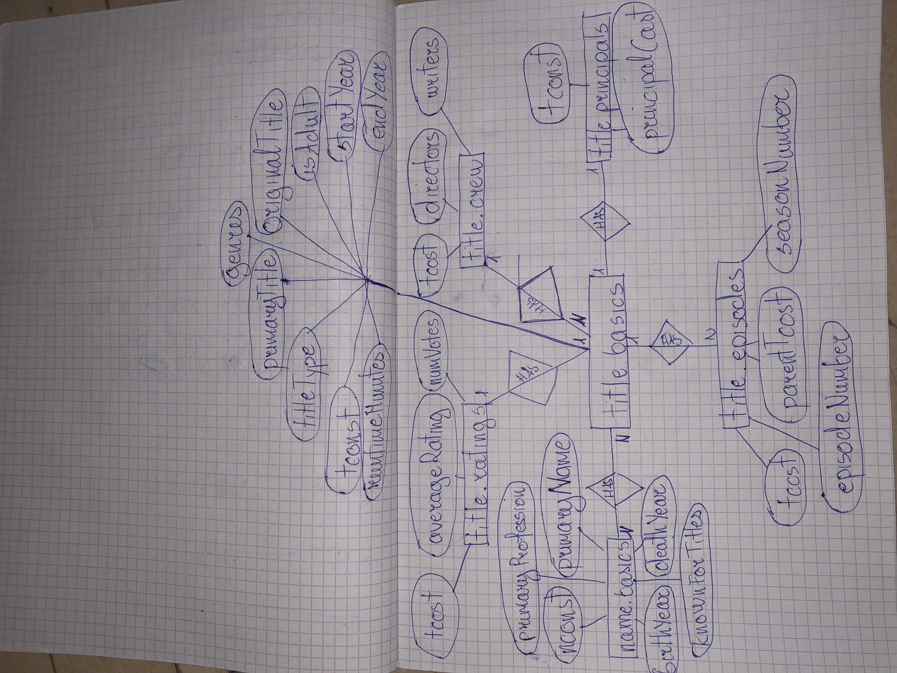

# Entity Relationship Diagram
#### NOTE! The Atributes in the second page are the Atributes of Entity "title.basics".
#### NOTE! The diamonds in every connection represent relationship and means "has".
#### NOTE! N - stands for Many.
#### CLICK ON THE PICTURE TO SEE IT VERTICALLY

